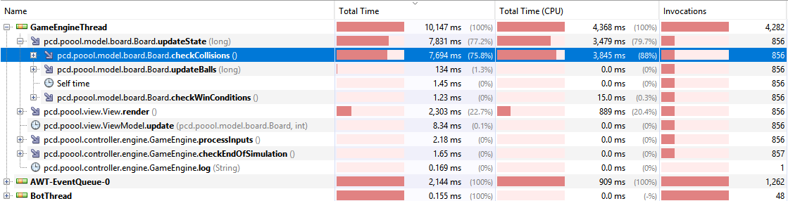
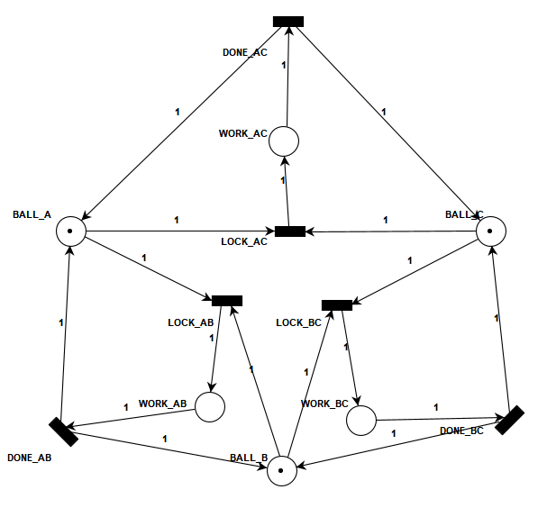
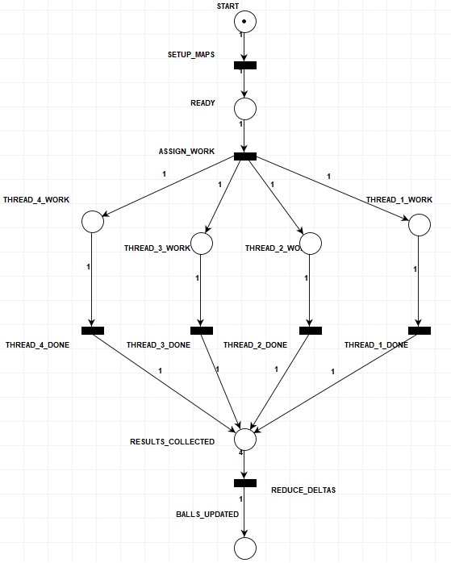

# Poool Game - Concurrent Implementation

## 1. Problem Analysis

From a concurrency perspective, the most critical aspect of the system is the collision resolution among balls.

The collision resolution algorithm is based on a pairwise comparison of all balls:

```java
for (int i = 0; i < balls.size() - 1; i++) {
    for (int j = i + 1; j < balls.size(); j++) {
        Ball.resolveCollision(balls.get(i), balls.get(j));
    }
}
```

This approach has quadratic time complexity O(n²), which becomes the dominant cost when the number of balls is large. Profiling with VisualVM confirms that this portion of the code represents 
the main computational bottleneck of the application.



Although inefficient from an algorithmic standpoint, this implementation provides a straightforward way to solve all possible collisions.
For this reason, it has been used as the baseline for the development of concurrent versions.

The challenge in parallelizing this computation lies in the fact that multiple threads may attempt to update the
state of the same ball concurrently, leading to data races and inconsistent states.

Two main strategies have been explored to address this issue:

- **Synchronized approach**: each collision check between a pair of balls is protected using synchronization mechanisms.
This guarantees correctness but introduces significant contention, limiting scalability.

- **Accumulator-based approach**: each thread computes partial updates independently using thread-local accumulators,
which are later merged in a reduction phase. This approach minimizes synchronization during the computation phase and
significantly improves performance.

In addition to collision handling, the system must also manage multiple active components:

- **Game loop** (GameEngine)
- **Rendering subsystem** (Java Swing Event Dispatch Thread)
- **Input producers** (Human inputs via GUI and bot)

These components operate concurrently and must be properly coordinated, introducing additional synchronization and communication challenges.

## 2. Architecture

The system is built upon a Model-View-Controller (MVC) architectural pattern.

- **Model**  
  The model is composed of the core game state and logic, including the board and the balls. It is responsible for maintaining the game state and enforcing the game logic.

- **Controller**  
  The controller is represented by the `GameEngine`, which implements the game loop. Input handling is mediated through the `CommandQueue`, with both the human player (via GUI events) and the `Bot` acting as producers of commands.  
  The controller is the only component allowed to modify the model.

- **View**  
  The view is implemented using Swing and is responsible for rendering the current game state.

### 2.1 GameEngine

The `GameEngine` acts as the central coordinator of the system and runs in its own thread. Its main responsibility is to ensure a consistent progression of the game state over time.

At each cycle, the game loop in it performs the following operations:

- Fetch and process all pending commands
- Update the model (ball movements, collisions, game logic)
- Ask the `View` to render the updated state

This design ensures that all state updates are performed sequentially within a single thread, simplifying correctness and avoiding race conditions on the game state.

### 2.2 Rendering

Rendering is implemented using the Java Swing toolkit, which imposes a strict constraint: all GUI updates must be executed on the Event Dispatch Thread.

To comply with this requirement, rendering requests are delegated to the EDT. In the current architecture, rendering is performed synchronously with respect to the game loop. As a consequence, the `GameEngine` waits until rendering is completed before proceeding to the next iteration.

This introduces a blocking point in the loop, meaning that the overall performance of the system is partially dependent on the rendering time for the sake of consistency.

### 2.3 Command-Based Input System

The system handles all external interactions through a unified command-based input architecture built on a producer-consumer pattern.

Input sources act as **producers**, while the `GameEngine` acts as the single **consumer** of all commands. Producers include:

- the human player, generating inputs via the Swing GUI
- the `Bot`, running in a separate thread

All inputs are converted into `Command` objects that encapsulate actions to be performed on the game model. These commands are submitted to a shared `CommandQueue`, implemented on top of a `BoundedBuffer` to ensure thread-safe communication between producers and the consumer.

User input is captured through Swing’s `KeyListener` interface on the Event Dispatch Thread (EDT), and translated into movement commands. Similarly, the bot periodically generates random movement commands autonomously during execution.

The `GameEngine` continuously drains the queue during each game loop iteration and executes the received commands. This ensures that all modifications to the game state are centralized within a single thread.

### 2.4 Collision Resolution
Collision resolution among balls is implemented using the Strategy Pattern, allowing different implementations to be swapped without modifying the core game logic.

The system defines a common interface:

```java
public interface CollisionResolver {
    void resolve(List<Ball> balls) throws InterruptedException;
}
```

Each implementation of `CollisionResolver` defines a different strategy for handling collision computation, including both sequential and concurrent versions.

The `GameEngine` delegates collision handling to the currently set `CollisionResolver`, treating it as a pluggable component of the simulation pipeline.

## 3. Parallel Collision Resolution

### 3.1 Naive Parallelization

A first attempt at parallelizing collision resolution was based on distributing the pairwise collision checks across multiple threads while protecting shared state through synchronization.

Given `n` balls, collision detection naturally forms a triangular iteration space where each ball `i` must be checked against all balls `j > i`. This can be viewed as a set of “rows”, where row `i` contains `n - i - 1` collision checks.

To efficiently parallelize this structure, a mirrored strided distribution strategy was adopted to balance the workload across threads.

Instead of assigning contiguous rows (which would lead to imbalance), each thread processes rows in a strided fashion and pairs each assigned row with its symmetric counterpart to balance expensive and cheap rows.

For example, with `5` balls and `2` threads:

```
Row 0: (0,1) (0,2) (0,3) (0,4)  [Thread 1]
Row 1:       (1,2) (1,3) (1,4)  [Thread 2]
Row 2:             (2,3) (2,4)  [Thread 1]
Row 3:                   (3,4)  [Thread 2]
Row 4:                          [Thread 1]

[Thread 1]: Row 0 + Row 4 + Row 2 = 6 checks
[Thread 2]: Row 1 + Row 3         = 4 checks
```

This strategy is implemented as follows:

```java
public class ThreadedCollisionResolver implements CollisionResolver {
    public void resolve(List<Ball> balls) throws InterruptedException {
        int n = balls.size();
        List<Thread> threads = new ArrayList<>(threadCount);
        for (int i = 0; i < threadCount; i++) {
            final int threadIndex = i;
            threads.add(new Thread(() -> {
                for (int j = threadIndex; j < n / 2; j += threadCount) {
                    processRow(j, balls);           // front rows
                    processRow(n - 1 - j, balls);   // mirrored rows
                }
                // handle leftover row for odd ball counts
                if (n % 2 != 0 && threadIndex == 0) {
                    processRow(n / 2, balls);
                }
            }));
            threads.get(i).start();
        }
        for (Thread t : threads) {
            t.join();
        }
    }
    public void processRow(int i, List<Ball> balls) {
        Ball ball = balls.get(i);
        for (int j = i + 1; j < balls.size(); j++) {
            Balls.resolveCollisionSynchronized(ball, balls.get(j));
        }
    }
}
```

Because multiple threads may update the same ball concurrently, each collision check must be synchronized. This is achieved by locking the two involved balls in a globally consistent order (based on their unique numerical ID), which prevents deadlocks while ensuring safe concurrent updates:

```java
public static void resolveCollisionSynchronized(Ball a, Ball b) {
    Ball first = (a.getId() < b.getId()) ? a : b;
    Ball second = (a.getId() < b.getId()) ? b : a;
    synchronized(first) {
        synchronized(second) {
            resolveCollision(a, b);
        }
    }
}
```

Despite the careful design of both workload distribution and synchronization, this approach exhibited poor performance in practice.

The main issue lies in high contention on shared objects. Although collision checks are distributed evenly, the underlying data (balls) are still shared across threads. Since each ball can be involved in multiple collisions within the same step, it becomes a synchronization hotspot.

This contention can be understood more clearly by modeling the synchronization structure as a Petri net.



*Petri net representation of the synchronized collision resolution. Each ball is modeled as a shared resource, and each collision check requires exclusive access to two balls. The resulting structure shows potential resource conflicts, limiting effective parallelism.*

### 3.2 Lock-Free Parallelization via Map-Reduce

The poor scalability of the synchronized approach stems from contention on shared state. Even with balanced workload distribution, threads frequently compete to update the same balls.

To address this, an alternative design was developed based on a Map-Reduce-style decomposition, which eliminates shared mutation during the parallel phase.



* **Fork Phase (`ASSIGN_WORK`):** The initial state is decomposed into `n` parallel execution paths.
* **Map Phase (`THREAD_X_WORK`):** Each thread operates in isolation on its own `CollisionAccumulator` map.
* **Join/Barrier (`RESULTS_COLLECTED`):** The model enforces synchronization; the `REDUCE` transition is only enabled once the place contains all `n` tokens.
* **Reduce Phase (`REDUCE_DELTAS`):** The final sequential aggregation where deltas are applied to the global state.

A key aspect of this design is how thread-local state is organized. Instead of a single shared structure, a list of accumulator maps is created:

```java
List<Map<Ball, CollisionAccumulator>> accumulatorMaps = new ArrayList<>();
for (int i = 0; i < threadCount; i++) {
    accumulatorMaps.add(new HashMap<>());
}
```

Each map is exclusively owned by a single thread and accessed via its `threadIndex`, ensuring that all writes during the Map phase remain thread-local.

#### Map Phase

The same mirrored strided distribution is reused, but instead of modifying balls directly, each thread writes into a private accumulator map. Each collision contributes deltas (position and velocity changes) to per-ball accumulators:

```java
CollisionAccumulator accumulatorOfBallA = accumulators.get(a);
if (accumulatorOfBallA == null) {
    accumulatorOfBallA = new CollisionAccumulator();
    accumulators.put(a, accumulatorOfBallA);
}
CollisionAccumulator accumulatorOfBallB = accumulators.get(b);
if (accumulatorOfBallB == null) {
    accumulatorOfBallB = new CollisionAccumulator();
    accumulators.put(b, accumulatorOfBallB);
}
accumulatorOfBallA.add(a_dx, a_dy, a_dvx, a_dvy);
accumulatorOfBallB.add(b_dx, b_dy, b_dvx, b_dvy);
```

Because each thread operates on its own map, no synchronization is required during this phase.

#### Reduce Phase

Once all threads complete, their results are merged sequentially:
```java
for (Ball ball : balls) {
    double dx = 0, dy = 0, dvx = 0, dvy = 0;
    for (Map<Ball, CollisionAccumulator> map : accumulatorMaps) {
        CollisionAccumulator acc = map.get(ball);
        if (acc != null) {
            dx += acc.getDeltaX();
            dy += acc.getDeltaY();
            dvx += acc.getDeltaVX();
            dvy += acc.getDeltaVY();
        }
    }
    ball.setPos(...);
    ball.setVel(...);
}
```

All updates are applied after parallel computation, ensuring consistency without locks.

### 3.3 Task-Based Variant Using ExecutorService
The previous implementation explicitly manages a fixed set of worker threads. While effective, this approach tightly couples the parallelization strategy to thread lifecycle management. To improve flexibility, a task-based variant was implemented using Java’s `ExecutorService`.

#### Map Phase
The core shift in this design is the move from pre-allocated state to asynchronous result tracking. As each task is dispatched to the thread pool, the ``ExecutorService`` immediately returns a ``Future``.

```java
List<Future<Map<Ball, CollisionAccumulator>>> futures = new ArrayList<>();
for (int t = 0; t < taskCount; t++) {
    final int taskId = t;
    futures.add(executor.submit(() -> {
        Map<Ball, CollisionAccumulator> accumulatorMap = new HashMap<>();
        for (int i = taskId; i < n / 2; i += taskCount) {
            processRow(i, balls, accumulatorMap);
            processRow(n - 1 - i, balls, accumulatorMap);
        }
        if (n % 2 != 0 && taskId == 0) {
            processRow(n / 2, balls, accumulatorMap);
        }
        return accumulatorMap;
    }));
}
```

#### Result Collection
Once all tasks have been submitted, the implementation iterates through the list of futures to collect the results. This is where the asynchronous submission transitions back to synchronous coordination:

```java
List<Map<Ball, CollisionAccumulator>> results = new ArrayList<>(taskCount);
for (Future<Map<Ball, CollisionAccumulator>> future : futures) {
    results.add(future.get());
}
```

#### Reduce Phase

The reduction phase remains unchanged: all partial results collected from the futures list are merged sequentially to produce the final state of each ball.

## 4. Testing and Performance Evaluation

### 4.1 Model Checking

Before evaluating performance, the correctness of the parallel resolvers was verified using Java PathFinder (JPF). This ensured that the concurrent logic was free of race conditions and produced consistent results across all thread interleavings.

The JPF test suite is located in the `java.pcd.poool.jpf` package. The results of the formal verification are summarized below:

* **TestUnsafeThreadedCollisionResolver**: **FAIL**. JPF successfully identified race conditions where checks and state changes were performed concurrently without synchronization.
* **TestThreadedCollisionResolver**: **PASS**. Verified that the synchronized approach is thread-safe.
* **TestThreadedLockFreeCollisionResolver**: **PASS**. Confirmed that the lock-free logic correctly manages concurrent state without data races.
* **TestPooledLockFreeCollisionResolver**: **N/A**. JPF currently does not support the formal verification of this resolver as it utilizes `java.util.concurrent.Future`, which is not supported by the current JPF core classes.

### 4.2 Performance Test Configuration

- **Benchmark Class:** `pcd.poool.benchmark.CollisionResolverBenchmark`
- **Configuration:** `MassiveConfiguration` (4,500 balls)
- **Simulation Parameters:** 60 seconds duration, "holeless" (no ball removals).
- **CPU:** Intel Core i7-12700F (12 Cores / 20 Threads)
- **Baseline:** Serial Resolver (16.45 FPS)

To evaluate the scalability of the resolvers, we use **FPS**, **Speedup**, and **Efficiency**:

1.  **Frames Per Second (FPS):** Calculated by dividing the total number of frames processed by the fixed simulation duration (60 seconds).
    $$\text{FPS} = \frac{\text{Total Frames}}{\text{Simulation Time}}$$
2.  **Speedup ($S$):** Calculated as $S = \frac{T_{serial}}{T_{n}}$, where $T_{serial}$ is the time taken by the serial implementation and $T_{n}$ is the time taken with $n$ cores. In this context, it is represented by the ratio of FPS: 
    $$S = \frac{\text{Parallel FPS}}{\text{Serial FPS}}$$
3.  **Efficiency ($E$):** Calculated as $E = \frac{S}{n}$, where $n$ is the number of processors. This represents how effectively each added processor contributes to performance.

### 4.3 Results

| Threads | Resolver | Avg FPS | Speedup | Efficiency |
|:---:|:---|:---:|:---:|:---:|
| 1 | **SerialCollisionResolver (Baseline)** | 16.45 | 1.00× | 1.00 |
| 1 | ThreadedCollisionResolver | 3.93 | 0.24× | 0.24 |
| 1 | PooledCollisionResolver | 4.02 | 0.24× | 0.24 |
| 1 | ThreadedLockFreeCollisionResolver | 13.62 | 0.83× | 0.83 |
| 1 | PooledLockFreeCollisionResolver | 12.57 | 0.76× | 0.76 |
| | | | | |
| 2 | ThreadedCollisionResolver | 7.97 | 0.48× | 0.24 |
| 2 | PooledCollisionResolver | 7.85 | 0.48× | 0.24 |
| 2 | **ThreadedLockFreeCollisionResolver** | 28.17 | 1.71× | **0.86** |
| 2 | PooledLockFreeCollisionResolver | 26.95 | 1.64× | 0.82 |
| | | | | |
| 4 | ThreadedCollisionResolver | 14.22 | 0.86× | 0.22 |
| 4 | PooledCollisionResolver | 14.90 | 0.91× | 0.23 |
| 4 | ThreadedLockFreeCollisionResolver | 42.05 | 2.56× | 0.64 |
| 4 | **PooledLockFreeCollisionResolver** | 42.43 | 2.58× | **0.65** |
| | | | | |
| 8 | ThreadedCollisionResolver | 22.20 | 1.35× | 0.17 |
| 8 | PooledCollisionResolver | 23.08 | 1.40× | 0.18 |
| 8 | **ThreadedLockFreeCollisionResolver** | 39.78 | 2.42× | 0.30 |
| 8 | PooledLockFreeCollisionResolver | 38.87 | 2.36× | 0.30 |
| | | | | |
| 20 | ThreadedCollisionResolver | 25.83 | 1.57× | 0.08 |
| 20 | PooledCollisionResolver | 27.35 | 1.66× | 0.08 |
| 20 | ThreadedLockFreeCollisionResolver | 38.70 | 2.35× | 0.12 |
| 20 | **PooledLockFreeCollisionResolver** | 39.20 | 2.38× | 0.12 |

### 4.4 Key Takeaways

The results clearly highlight the advantages of the lock-free design. Both lock-free resolvers consistently outperform their synchronized counterparts, which fail to surpass the serial baseline until higher thread counts are reached. This confirms that contention on shared state severely limits the scalability of the lock-based approaches.

In terms of scalability, the system achieves its highest efficiency at 2 threads (E = 0.86), while peak performance is reached at 4 threads. Beyond this point, additional parallelism yields diminishing returns, indicating that the workload becomes increasingly limited by coordination overhead rather than computation.

At higher thread counts, particularly at 20 threads, efficiency drops significantly (E = 0.12). This behavior suggests that factors such as synchronization overhead, memory contention, and cache effects dominate execution, ultimately offsetting the benefits of increased parallelism.