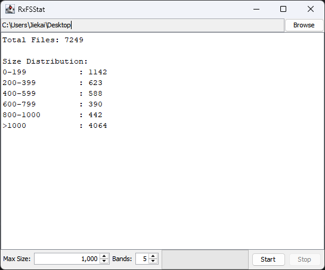

# FSStat

## 1. Problem Analysis
The assignment involves traversing a hierarchical file system to collect size-based statistics. This problem presents several challenges from a concurrent programming perspective:

* File system operations (listing directory contents, fetching file attributes) are inherently slow compared to CPU operations. Blocking threads during these operations leads to resource underutilization.
* The directory structure is a tree. A concurrent solution must fork to explore sub-directories in parallel while managing the lifecycle of these asynchronous tasks.
* Statistics from different branches of the tree must be merged. This requires a careful strategy to ensure the final report is accurate and complete.

## 2. Implementation Strategies

The project was implemented using three distinct paradigms, focusing on the programming discipline that characterises each approach.

### 2.1 Asynchronous Programming (Event-Loop / Vert.x)
The Vert.x implementation follows the **Asynchronous CPS** using a non-blocking event-driven model.

* Unlike a standard recursive call that blocks the stack, `scanDirectory` initiates an asynchronous operation via `vertx.fileSystem().readDir()`, which returns a list of paths in the local directory. The result is handled in a deferred manner through the `.compose()` operator.
* The logic is structured as a chain of `Future` objects. For each path discovered, `processPath()` is called, which asynchronously fetches file properties via `FileProps.props()`. This ensures the Event Loop thread is never blocked while waiting for disk I/O.
* To handle the hierarchical nature of the file system, `Future.all(futures)` was used. This acts as a non-blocking barrier that waits for all sub-directory scans to complete before executing a `map` transformation to merge partial `FSReport` objects.
* Individual file processing (`assignToBucket()`) is treated as a synchronous computation executed immediately upon completion of the property-fetch future.

### 2.3 Virtual Threads
The Virtual Thread implementation prioritizes simplicity, returning to a synchronous coding style without sacrificing the scalability typically reserved for event-driven systems.

* While this version utilizes `java.util.concurrent.Future`, it avoids the "future-chained" logic in the Vert.x version. Instead of composing behaviors with callbacks (e.g., `.compose()`), the code follows a linear flow where the result of a sub-task is consumed directly via blocking calls.
* A **Fork-Join** strategy was implemented using `Executors.newVirtualThreadPerTaskExecutor()`. 
    * **Fork:** When a sub-directory is found, a new task is submitted to the executor, spawning a Virtual Thread.
    * **Join:** The parent thread then calls `future.get()`. Unlike platform threads, when a Virtual Thread blocks on `.get()`, it is unmounted from the carrier thread, allowing the system to continue processing other tasks.
* The implementation uses standard `java.nio.file` calls and demonstrates that with Virtual Threads, "blocking" is no longer a big issue.

### 2.3 Reactive Programming (RxJava + Interactive GUI)
This version treats the file system as a stream of asynchronous events, utilizing a functional-declarative style to implement the interactive extension (Swing GUI).

* **Cold to Hot Stream Transformation:**
    * The `scanDirectory` method defines a cold observable that only begins the I/O traversal upon subscription. 
    * To prevent redundant file system scans for multiple consumers, the cold observable is transformed into a hot observable. Using `replay(1)` ensures that the most recent state is cached for late subscribers, while `refCount()` manages the connection lifecycle.
* **Functional Pipeline & Accumulation:**
    * The `.scan()` operator is used to transform a stream of individual file events into an accumulated, rolling `ImmutableFSReport`. 
    * By merging the periodic throttle `ui` observable with the `finalReport` one (the absolute last emission), the implementation ensures the GUI remains responsive during execution and accurate upon completion.
* **Performance & Interactivity:**
    * To maintain GUI responsiveness, `.throttleLast(100, TimeUnit.MILLISECONDS)` is used. This prevents the UI from freezing due to excessive rendering calls, limiting refreshes to 10Hz.
    * `Observable.using()` wraps the `Files.list()` call, ensuring that file handles are automatically closed upon stream completion or disposal.
* **GUI Integration:**
    * The pipeline delegates I/O tasks to `Schedulers.io()` while using `observeOn(SwingUtilities::invokeLater)` to ensure all UI updates occur safely on the Event Dispatch Thread (EDT).
    * The "Stop" functionality is implemented via `subscription.dispose()`, which propagates an unsubscribe signal up the reactive chain.

