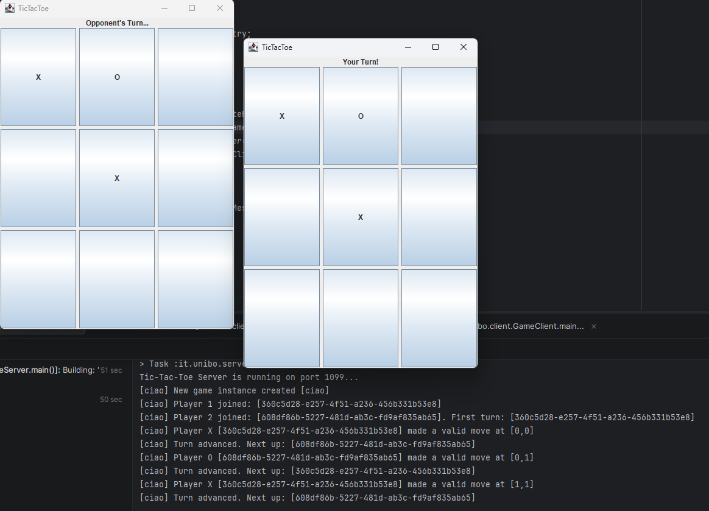

# Distributed Tic-Tac-Toe Implementation (Java RMI)

## 1. Problem Analysis
Implementing Tic-Tac-Toe as a distributed system using Java RMI introduces several challenges regarding state synchronization,
remote reference management and concurrent programming.
The primary one is the shift from implementing simple game logic to coordinating multiple clients that interact with a remote game state across separate JVMs.

From a concurrent and distributed point of view, the following critical aspects must be handled:

* A player creating a game or waiting for an opponent’s turn must not freeze the application. 
The system must track remote game updates in a way that keeps the local user interface responsive while waiting for the other player to act.
* Multiple clients may attempt to create, join and view games simultaneously. Since RMI handles concurrent remote requests using a pool of server threads, 
operations such as creating a game instance, allocating a player slot and mutating the board grid must be synchronized to prevent race conditions.

## 2. General Strategy and Implementation Details

### Architecture and Session Lifecycle
The system separates global session management from active gameplay using two distinct layers of remote interfaces:

* **GameManager**: Bound to the RMI registry under the identifier `"GameManager"`. It acts as the global entry point for clients,
managing a collection of active game instances within a `ConcurrentHashMap`.
* **Game**: Instantiated dynamically upon a `createGame` request. When a client calls `joinGame`, the manager returns a stub of the specific `GameImpl` instance.
Clients then interact directly with their designated game session.

### Concurrency and Synchronization
Java RMI dispatches each incoming client request on a separate thread drawn from its internal pool, so shared state must be explicitly protected.

* `GameManagerImpl` synchronizes `createGame` and `joinGame` to ensure mutual exclusion during the game instance setup,
preventing two or more clients from racing to create or join the same room simultaneously.
* `GameImpl` protects all state-mutating methods (`addPlayer`, `makeMove`, `getBoard`, etc.) with `synchronized`,
ensuring that turn verification, symbol placement, and win/draw evaluation are performed atomically.

### Data Transfer and Remote References
* The `Board` state and `GameStatus` enum are serialized and transmitted by value when queried by clients.
* Both the main instance manager (`GameManagerImpl`) and the individual game instances (`GameImpl`) are remote objects managed by reference.
When clients connect, they interact exclusively through remote proxy stubs, ensuring all actions are processed on the server side.

### Client Design
Because remote calls in Java RMI are blocking operations, executing them directly on the user interface thread would cause the application to freeze.
To prevent this, the client-side design isolates all network I/O from the Event Dispatch Thread (EDT):

* Since methods in `GameSession` like `createGame`, `joinGame`, `isMyTurn` and `makeMove` are blocking network calls,
they are have been encapsulated inside a custom `runAsync` worker thread utility in the GUI. This guarantees that the user interface remains responsive while waiting for the server operations to complete.

* Game state synchronization is handled by a `ScheduledExecutorService` inside `GameSession`.
This background scheduler continuously pulls the current board status from the server every 500ms without blocking  the GUI.

